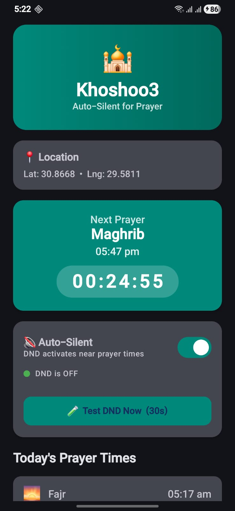
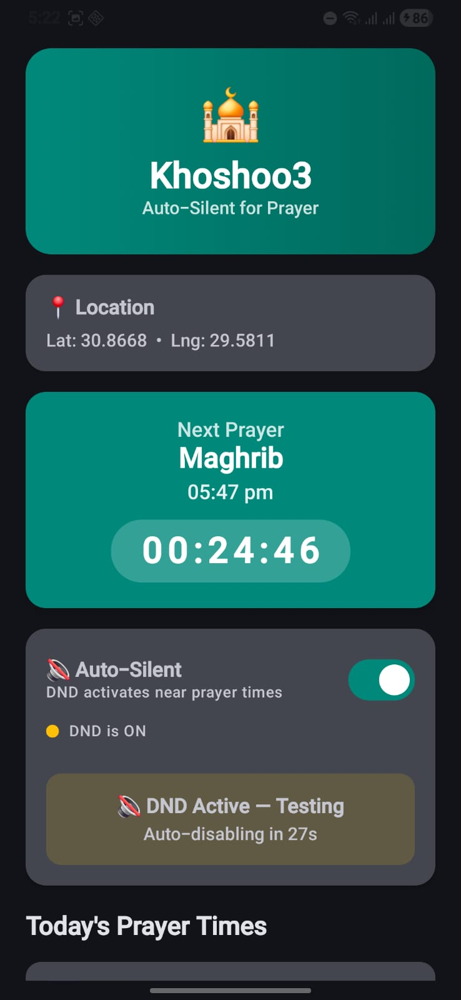

# 🕌 Khoshoo3

A Proof of Concept Android app that automatically toggles **Do Not Disturb** mode during Islamic prayer times.

The app calculates prayer times locally using the [Adhan](https://github.com/batoulapps/adhan-java) library (Egyptian General Authority method) and uses **WorkManager** to check every 15 minutes if the current time falls within a prayer window. If it does, it silences the phone automatically and restores the ringer when the window ends.

> Built as a PoC with the assistance of **Antigravity** (AI coding agent).

---

## 📱 Screenshots

| Main Screen | DND Active |
|:-----------:|:----------:|
|  |  |
